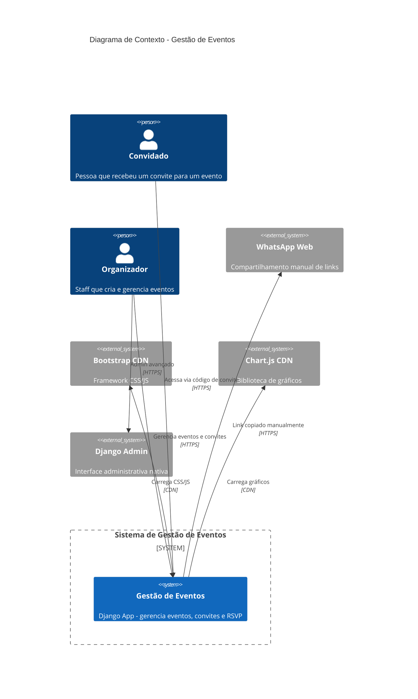

# Arquitetura — Gestão de Eventos

## Visão Geral

Sistema monolítico Django para gestão de eventos com foco em RSVP online. Arquitetura server-rendered (sem API REST), com formulários HTML e templates Django.

## Stack Tecnológica

| Camada | Tecnologia | Versão |
|--------|-----------|--------|
| Backend | Django (Python) | 6.0.3 |
| Frontend | Bootstrap 5 + Chart.js (CDN) | 5.3.3 / 4.4.1 |
| Banco | SQLite (dev) / PostgreSQL (config .env) | — |
| Imagens | Pillow | 12.2.0 |
| Deploy | PythonAnywhere | — |

## Estilo Arquitetural

- **Monolítico**: única aplicação Django com 1 app customizado (`eventos`)
- **Server-Rendered**: todas as respostas são HTML renderizado no servidor
- **Form-based**: sem API REST ou GraphQL — interações via formulários HTML com CSRF
- **Session Auth**: autenticação via sessões Django (cookie-based)
- **CDN Frontend**: Bootstrap e Chart.js carregados via CDN (sem bundle local)

## Diagrama de Contexto (C4 Nível 1)

## Decisões Arquiteturais Chave

1. **Invite-Centric Design**: Convite com código único, não Evento (ADR-001)
2. **Server-Rendered**: sem API — adequado para o escopo atual, mas limita integrações
3. **Single App**: toda lógica em `eventos/` — coeso mas sem separação de domínios
4. **Staff como Organizador**: reuso do `is_staff` Django sem modelo de perfil extra

## Dívidas Técnicas 🔴

1. **`DEBUG = True`** em produção potencial — inseguro
2. **Secret Key hardcoded** em settings.py — .env existe mas não é lido
3. **SQLite configurado** mas .env tem PostgreSQL — config híbrida entre dev/prod
4. **Zero testes** — tests.py vazio
5. **Possível AttributeError** — `convites.first().codigo_acesso` sem checar existência
6. **CDN dependencies** — sem fallback offline para Bootstrap/Chart.js
7. **Dados sensíveis no .env** — .env.versionado (no git?)
