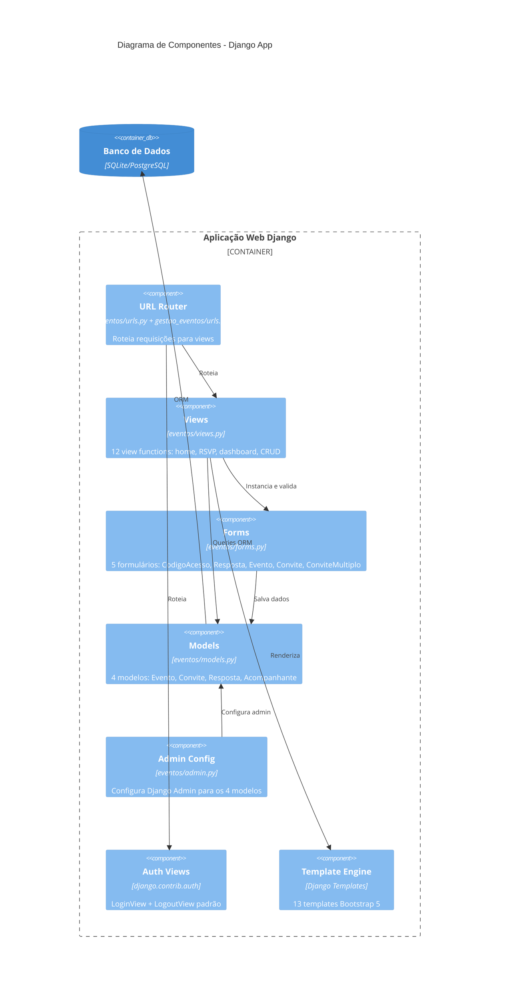

# Diagrama C4 — Componentes (Nível 3)

## Container: Aplicação Web (Django)

## Views por Tipo

### Públicas
| Componente | Rota | Template |
|-----------|------|----------|
| `home_view` | GET/POST `/` | home.html |
| `responder_evento_view` | GET/POST `/evento/<codigo>/` | responder_evento.html |
| `sucesso_view` | GET `/sucesso/` | sucesso.html |

### Autenticação
| Componente | Rota | Template |
|-----------|------|----------|
| `LoginView` | GET/POST `/login/` | registration/login.html |
| `LogoutView` | POST `/logout/` | — (redirect) |

### Dashboard (Staff)
| Componente | Rota | Template |
|-----------|------|----------|
| `dashboard_view` | GET `/dashboard/` | dashboard/dashboard.html |
| `estatisticas_dashboard_view` | GET `/dashboard/estatisticas/` | dashboard/estatisticas.html |
| `detalhe_evento_dashboard_view` | GET `/dashboard/evento/<id>/` | dashboard/detalhe_evento.html |
| `criar_evento_view` | GET/POST `/dashboard/criar/` | dashboard/form_evento.html |
| `editar_evento_view` | GET/POST `/dashboard/evento/<id>/editar/` | dashboard/form_evento.html |
| `gerenciar_convites_view` | GET/POST `/dashboard/evento/<id>/convites/` | dashboard/gerenciar_convites.html |
| `criar_convites_multiplos_view` | GET/POST `/dashboard/evento/<id>/convites/criar/` | dashboard/criar_convites_multiplos.html |
| `excluir_convite_view` | GET `/dashboard/convite/<id>/excluir/` | — (redirect) |
| `gerar_link_convite_view` | GET `/dashboard/convite/<id>/link/` | — (JSON) |
