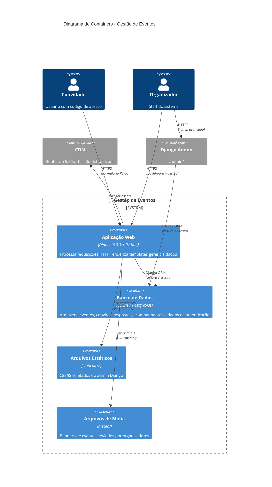

# Diagrama C4 — Containers (Nível 2)

## Containers

| Container | Tecnologia | Responsabilidade |
|-----------|-----------|------------------|
| **Web App** | Django 6.0.3 / Python | Processar requisições, autenticar, renderizar templates, servir formulários, gerar gráficos (dados inline) |
| **Banco de Dados** | SQLite / PostgreSQL | Persistir dados de Evento, Convite, Resposta, Acompanhante, auth.User |
| **Estáticos** | staticfiles/ | Arquivos coletados do admin Django |
| **Mídia** | media/ | Banners de eventos (imagens) |

## Observações

- **Sem container de cache** (Redis/Memcached) — todas as queries vão direto ao banco
- **Sem fila** (Celery/RQ) — operações síncronas
- **Sem API Gateway** — Django serve tudo diretamente
- **WSGI + Gunicorn** para produção (PythonAnywhere)
