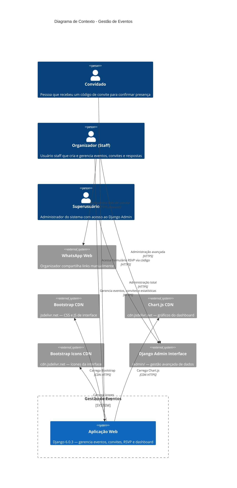

# Diagrama C4 — Contexto (Nível 1)

## Sistema: Gestão de Eventos

## Usuários do Sistema

| Ator | Descrição | Acessa |
|------|-----------|--------|
| Convidado | Pessoa com código de convite | Apenas `/` e `/evento/<codigo>/` |
| Organizador | Staff Django | Dashboard, admin básico |
| Superusuário | is_superuser | Tudo, incluindo Django Admin completo |

## Sistemas Externos

| Sistema | Tipo | Direção | Descrição |
|---------|------|---------|-----------|
| WhatsApp Web | Manual | Saída | Organizador copia link e cola no WhatsApp |
| Bootstrap CDN | CDN | Entrada | Framework CSS/JS para frontend |
| Chart.js CDN | CDN | Entrada | Biblioteca de gráficos |
| Bootstrap Icons CDN | CDN | Entrada | Pacote de ícones |
| Django Admin | Built-in | Interno | Interface administrativa nativa do Django |
