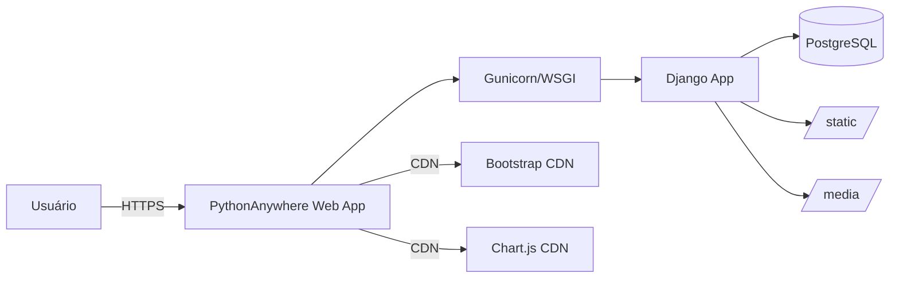

# Deployment — Gestão de Eventos

## Stack de Produção (PythonAnywhere)



## Configuração de Produção

**PythonAnywhere** (documentado em `DEPLOY_PYTHONANYWHERE.md`):
- WSGI customizado: `gestao_eventos/wsgi_pa.py`
- Virtualenv em `/home/israelsilva/gestao_eventos/venv/`
- Static files em `/home/israelsilva/gestao_eventos/staticfiles/`
- Media files em `/home/israelsilva/gestao_eventos/media/`

## Variáveis de Ambiente (`.env`)

```
DJANGO_SECRET_KEY=<chave>
DEBUG=False
DB_NAME=gestao_eventos
DB_USER=gestao_user
DB_PASSWORD=<senha>
DB_HOST=localhost
DB_PORT=5432
SECURE_SSL_REDIRECT=True
```

**Nota**: O `settings.py` lê as variáveis de ambiente via `python-decouple`. O PostgreSQL está ativo. `DEBUG` e `SECRET_KEY` são controlados pelo `.env`.

## Checklist de Deploy

- [ ] Gerar SECRET_KEY segura e configurar em produção
- [ ] Definir `DEBUG=False`
- [ ] Configurar `ALLOWED_HOSTS` com domínio real
- [X] Migrar para PostgreSQL (ativo via .env)
- [ ] Rodar `collectstatic`
- [ ] Configurar servidor de media (ou usar S3)
- [ ] Configurar HTTPS (PythonAnywhere faz isso automaticamente)
- [ ] Desabilitar CDN ou ter fallback local
