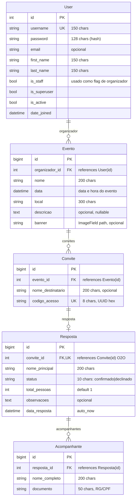

# Diagrama ERD Completo — Gestão de Eventos

## Entidades e Relacionamentos



## Cardinalidades

| Origem | Destino | Tipo | Descrição |
|--------|---------|------|-----------|
| User | Evento | 1:N | Um organizador pode criar N eventos |
| Evento | Convite | 1:N | Um evento pode ter N convites |
| Convite | Resposta | 1:1 | Um convite tem no máximo UMA resposta |
| Resposta | Acompanhante | 1:N | Uma resposta pode ter N acompanhantes |

## Chaves e Constraints

| Tabela | Chave Primária | Chaves Estrangeiras | Únicos |
|--------|---------------|--------------------|--------|
| auth_user | id | — | username |
| eventos_evento | id | organizador_id → auth_user.id | — |
| eventos_convite | id | evento_id → eventos_evento.id | codigo_acesso |
| eventos_resposta | id | convite_id → eventos_convite.id | convite_id (O2O) |
| eventos_acompanhante | id | resposta_id → eventos_resposta.id | — |

## SQL Equivalente (Resumo)

```sql
-- auth_user já existe do Django

CREATE TABLE eventos_evento (
    id BIGINT PRIMARY KEY,
    organizador_id INTEGER NOT NULL REFERENCES auth_user(id),
    nome VARCHAR(200) NOT NULL,
    data TIMESTAMP NOT NULL,
    local VARCHAR(300) NOT NULL,
    descricao TEXT,
    banner VARCHAR(100)
);

CREATE TABLE eventos_convite (
    id BIGINT PRIMARY KEY,
    evento_id BIGINT NOT NULL REFERENCES eventos_evento(id),
    nome_destinatario VARCHAR(200),
    codigo_acesso VARCHAR(8) NOT NULL UNIQUE
);

CREATE TABLE eventos_resposta (
    id BIGINT PRIMARY KEY,
    convite_id BIGINT UNIQUE REFERENCES eventos_convite(id),
    nome_principal VARCHAR(200) NOT NULL,
    status VARCHAR(10) NOT NULL CHECK (status IN ('confirmado', 'declinado')),
    total_pessoas INTEGER NOT NULL DEFAULT 1,
    observacoes TEXT,
    data_resposta TIMESTAMP NOT NULL
);

CREATE TABLE eventos_acompanhante (
    id BIGINT PRIMARY KEY,
    resposta_id BIGINT NOT NULL REFERENCES eventos_resposta(id),
    nome_completo VARCHAR(200) NOT NULL,
    documento VARCHAR(50) NOT NULL
);
```
