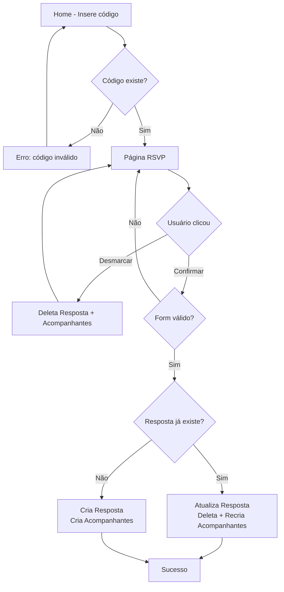
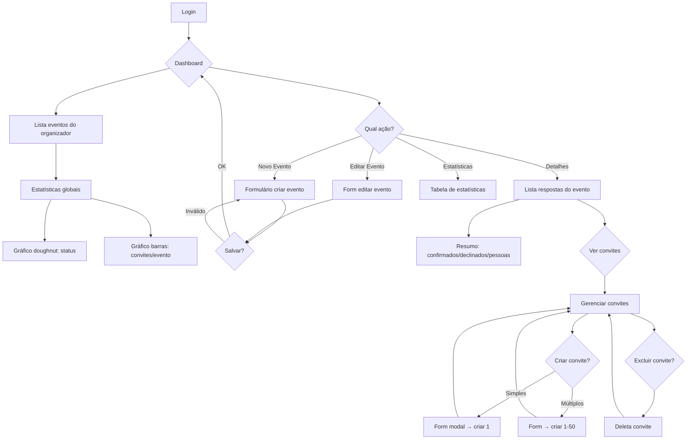
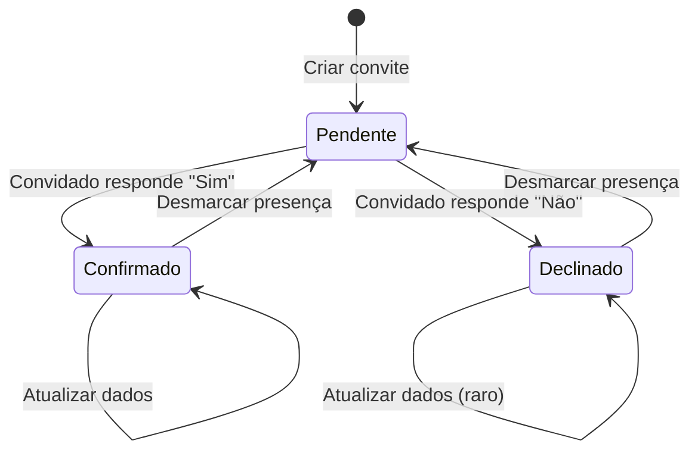
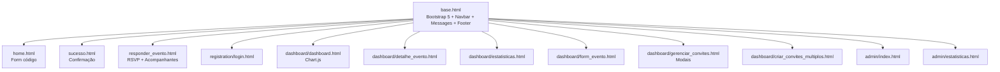

# Fluxogramas do Módulo — eventos

## Fluxo Principal: Convidado

```mermaid
flowchart TD
    A[Home - Insere código] --> B{Código existe?}
    B -->|Não| C[Erro: código inválido]
    C --> A
    B -->|Sim| D[Página RSVP]
    
    D --> E{Usuário clicou}
    E -->|Desmarcar| F[Deleta Resposta + Acompanhantes]
    F --> D
    E -->|Confirmar| G{Form válido?}
    G -->|Não| D
    G -->|Sim| H{Resposta já existe?}
    H -->|Sim| I[Atualiza Resposta<br>Deleta + Recria Acompanhantes]
    H -->|Não| J[Cria Resposta<br>Cria Acompanhantes]
    I --> K[Sucesso]
    J --> K
```

## Fluxo Principal: Organizador (Dashboard)

```mermaid
flowchart TD
    A[Login] --> B{Dashboard}
    B --> C[Lista eventos do organizador]
    C --> D[Estatísticas globais]
    D --> E[Gráfico doughnut: status]
    D --> F[Gráfico barras: convites/evento]
    B --> G{Qual ação?}
    
    G -->|Novo Evento| H[Formulário criar evento]
    H --> I{Salvar?}
    I -->|OK| B
    I -->|Inválido| H
    
    G -->|Detalhes| J[Lista respostas do evento]
    J --> K[Resumo: confirmados/declinados/pessoas]
    J --> L{Ver convites}
    
    L --> M[Gerenciar convites]
    M --> N{Criar convite?}
    N -->|Simples| O[Form modal → criar 1]
    N -->|Múltiplos| P[Form → criar 1-50]
    O --> M
    P --> M
    M --> Q{Excluir convite?}
    Q --> R[Deleta convite]
    R --> M
    
    G -->|Editar Evento| S[Form editar evento]
    S --> I
    
    G -->|Estatísticas| T[Tabela de estatísticas]
```

## Máquina de Estados da Resposta

```mermaid
stateDiagram-v2
    [*] --> Pendente: Criar convite
    Pendente --> Confirmado: Convidado responde "Sim"
    Pendente --> Declinado: Convidado responde "Não"
    Confirmado --> Pendente: Desmarcar presença
    Declinado --> Pendente: Desmarcar presença
    Confirmado --> Confirmado: Atualizar dados
    Declinado --> Declinado: Atualizar dados (raro)
```

## Hierarquia de Templates

```mermaid
flowchart TD
    A[base.html<br>Bootstrap 5 + Navbar + Messages + Footer]
    A --> B[home.html<br>Form código]
    A --> C[sucesso.html<br>Confirmação]
    A --> D[responder_evento.html<br>RSVP + Acompanhantes]
    A --> E[registration/login.html]
    A --> F[dashboard/dashboard.html<br>Chart.js]
    A --> G[dashboard/detalhe_evento.html]
    A --> H[dashboard/estatisticas.html]
    A --> I[dashboard/form_evento.html]
    A --> J[dashboard/gerenciar_convites.html<br>Modais]
    A --> K[dashboard/criar_convites_multiplos.html]
    A --> L[admin/index.html]
    A --> M[admin/estatisticas.html]
```
