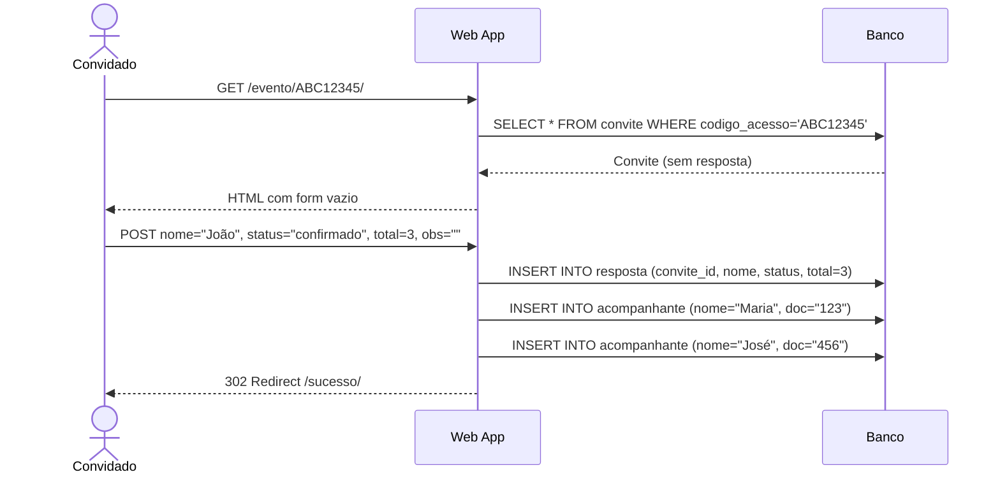
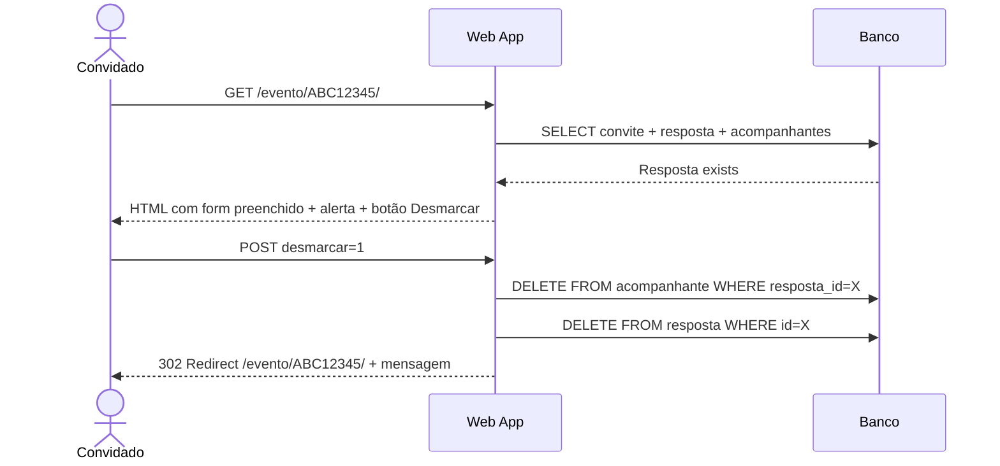
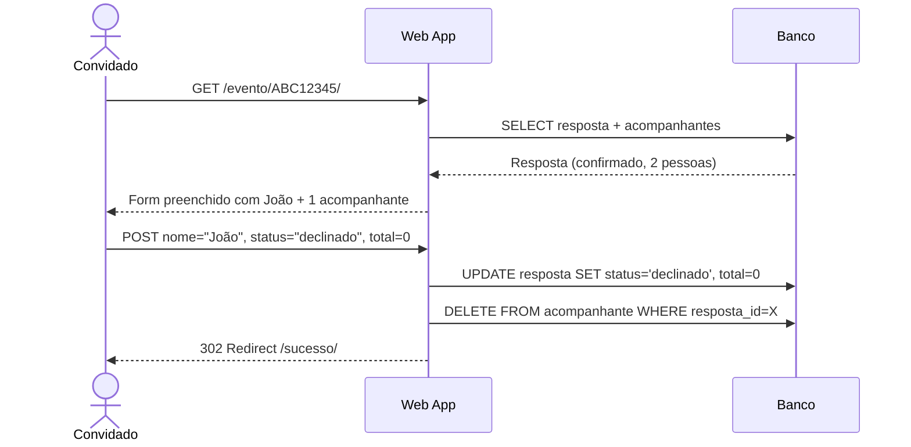
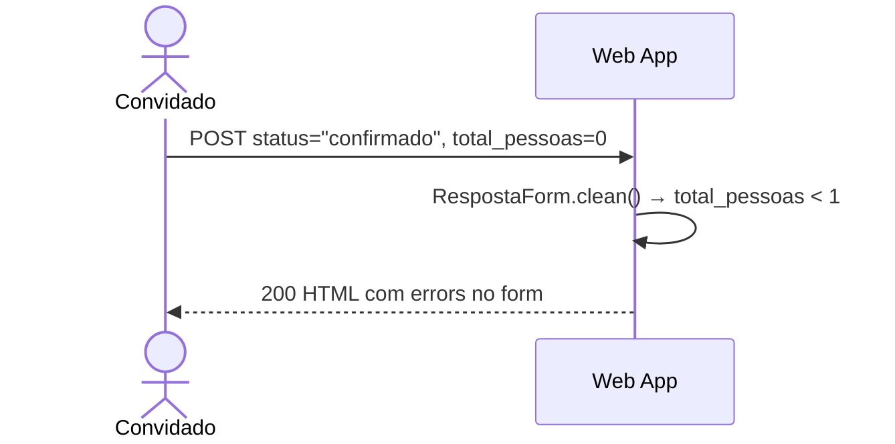

# Responder Evento, Fluxos Detalhados

## Fluxo 1: Primeira Resposta (Happy Path)

```mermaid
sequenceDiagram
    actor C as Convidado
    participant W as Web App
    participant DB as Banco

    C->>W: GET /evento/ABC12345/
    W->>DB: SELECT * FROM convite WHERE codigo_acesso='ABC12345'
    DB-->>W: Convite (sem resposta)
    W-->>C: HTML com form vazio
    
    C->>W: POST nome="João", status="confirmado", total=3, obs=""
    W->>DB: INSERT INTO resposta (convite_id, nome, status, total=3)
    W->>DB: INSERT INTO acompanhante (nome="Maria", doc="123")
    W->>DB: INSERT INTO acompanhante (nome="José", doc="456")
    W-->>C: 302 Redirect /sucesso/
```

## Fluxo 2: Cancelamento

```mermaid
sequenceDiagram
    actor C as Convidado
    participant W as Web App
    participant DB as Banco

    C->>W: GET /evento/ABC12345/
    W->>DB: SELECT convite + resposta + acompanhantes
    DB-->>W: Resposta exists
    W-->>C: HTML com form preenchido + alerta + botão Desmarcar
    
    C->>W: POST desmarcar=1
    W->>DB: DELETE FROM acompanhante WHERE resposta_id=X
    W->>DB: DELETE FROM resposta WHERE id=X
    W-->>C: 302 Redirect /evento/ABC12345/ + mensagem
```

## Fluxo 3: Atualização de Resposta

```mermaid
sequenceDiagram
    actor C as Convidado
    participant W as Web App
    participant DB as Banco

    C->>W: GET /evento/ABC12345/
    W->>DB: SELECT resposta + acompanhantes
    DB-->>W: Resposta (confirmado, 2 pessoas)
    W-->>C: Form preenchido com João + 1 acompanhante
    
    C->>W: POST nome="João", status="declinado", total=0
    W->>DB: UPDATE resposta SET status='declinado', total=0
    W->>DB: DELETE FROM acompanhante WHERE resposta_id=X
    W-->>C: 302 Redirect /sucesso/
```

## Fluxo 4: Erro de Validação

```mermaid
sequenceDiagram
    actor C as Convidado
    participant W as Web App

    C->>W: POST status="confirmado", total_pessoas=0
    W->>W: RespostaForm.clean() → total_pessoas < 1
    W-->>C: 200 HTML com errors no form
```
