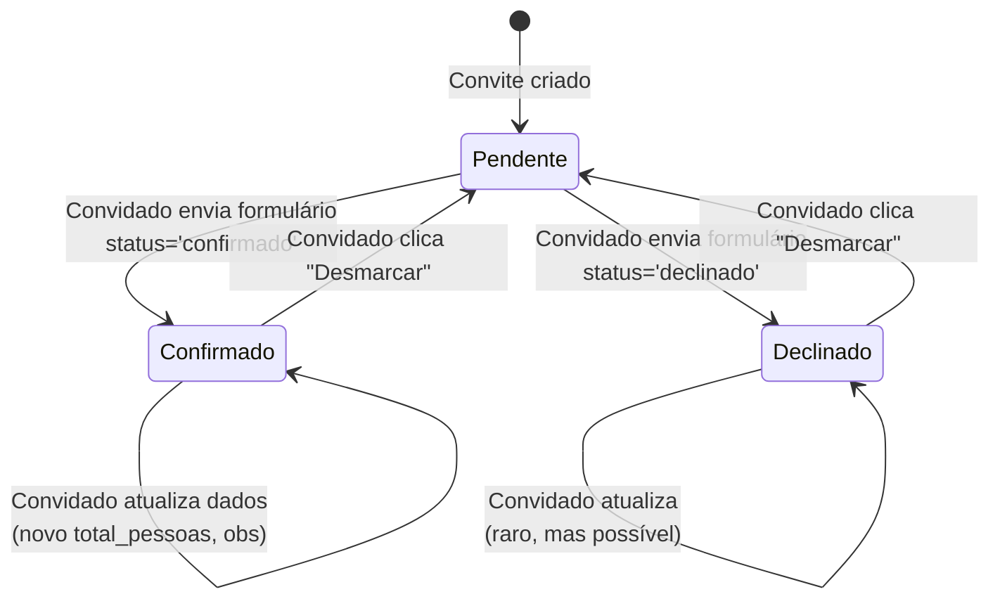

# Máquinas de Estado — Gestão de Eventos

## Estado da Resposta (RSVP)

A entidade **Resposta** possui um campo `status` com dois valores possíveis.

### Diagrama de Estados

### Tabela de Transições

| Estado Atual | Ação | Gatilho | Estado Seguinte | Validação |
|-------------|------|---------|-----------------|-----------|
| Pendente | Confirmar | POST formulário RSVP (status=confirmado) | Confirmado | total_pessoas >= 1 |
| Pendente | Recusar | POST formulário RSVP (status=declinado) | Declinado | total_pessoas = 0 |
| Confirmado | Atualizar | POST formulário RSVP (status=confirmado) | Confirmado | total_pessoas >= 1 |
| Confirmado | Desmarcar | POST formulário com `desmarcar` | Pendente | Resposta é DELETADA |
| Declinado | Atualizar | POST formulário RSVP (status=declinado) | Declinado | total_pessoas = 0 |
| Declinado | Desmarcar | POST formulário com `desmarcar` | Pendente | Resposta é DELETADA |

🟢 CONFIRMADO

### Estados por Entidade de Banco

| Estado | `Resposta.status` | `Resposta.total_pessoas` | `Acompanhante` |
|--------|-------------------|-------------------------|----------------|
| Pendente | — (sem Resposta) | — | — |
| Confirmado | 'confirmado' | >= 1 | Lista de acompanhantes (total_pessoas - 1) |
| Declinado | 'declinado' | 0 | Vazio |

🟢 CONFIRMADO

### Observações

1. **Pendente não é um estado no banco** — é a ausência de uma Resposta (Convite sem `resposta` related) 🔶
2. **Desmarcar é destrutivo** — a Resposta é excluída fisicamente, não há um status "cancelado"
3. **Auto-merge de atualização**: não há bloqueio de concorrência — duas submissões simultâneas podem causar perda de dados de acompanhantes (sempre deletados e recriados)
4. **Transição direta Confirmado ↔ Declinado**: não é possível ir direto de Confirmado para Declinado ou vice-versa sem usar o fluxo de atualização — o form permite ambas as opções de status na edição

🟡 INFERIDO
