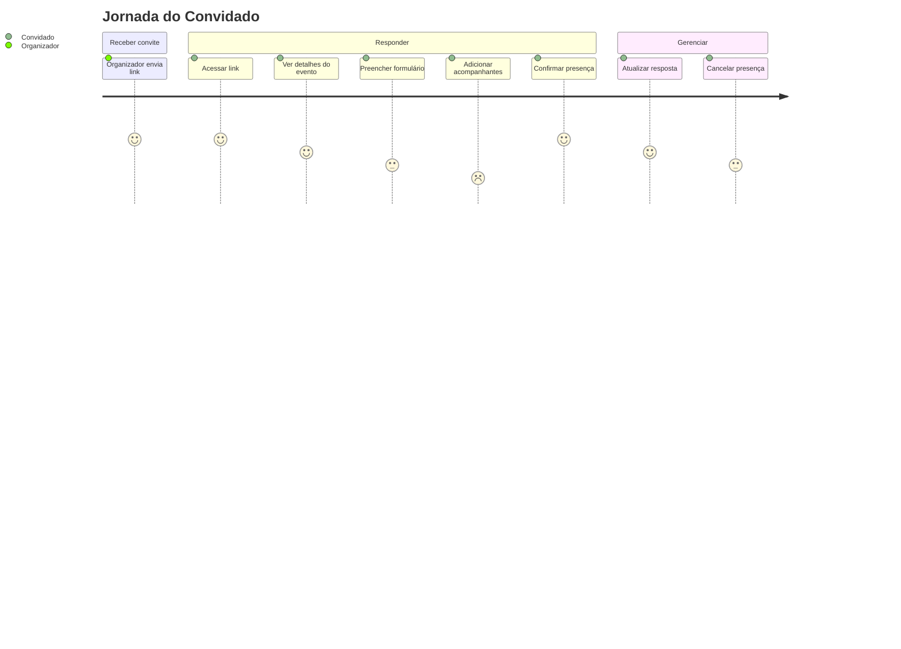

# User Story: Fluxo do Convidado

## Jornada Completa



## Cenário 1: Convidado confirma presença

```gherkin
Dado que o convidado recebeu um link de convite
Quando ele acessa o link e preenche o formulário com "Sim, irei"
E informa seu nome e 2 acompanhantes
Então o sistema salva a resposta
E o convidado vê a página de confirmação
```

## Cenário 2: Convidado recusa

```gherkin
Dado que o convidado recebeu um link de convite
Quando ele acessa o link e seleciona "Não poderei ir"
Então o sistema salva a recusa com total_pessoas = 0
E o convidado vê a página de confirmação
```

## Cenário 3: Convidado desmarca presença

```gherkin
Dado que o convidado já respondeu "Sim, irei"
Quando ele clica em "Desmarcar Presença" e confirma
Então o sistema exclui sua resposta e acompanhantes
E o convite volta ao estado pendente
```
