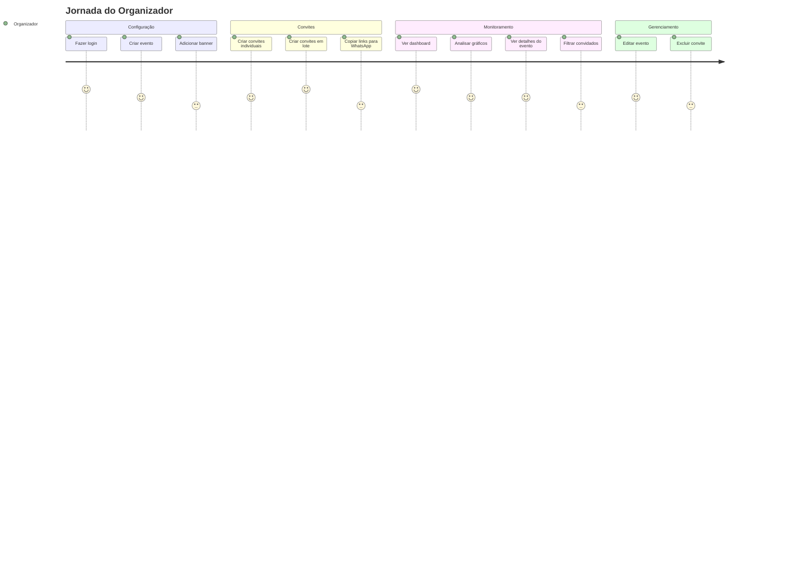

# User Story: Fluxo do Organizador

## Jornada Completa



## Cenário 1: Organizador cria evento e convites

```gherkin
Dado que o organizador está logado no dashboard
Quando ele clica em "Novo Evento" e preenche nome, data, local
E adiciona um banner opcional
Então o evento é criado e aparece no dashboard

Quando ele acessa "Gerenciar Convites" do evento
E cria 10 convites em lote
Então 10 convites com códigos únicos são gerados
E o organizador pode copiar os links individualmente
```

## Cenário 2: Organizador analisa estatísticas

```gherkin
Dado que existem convites com respostas
Quando o organizador acessa o Dashboard
Então ele vê 4 stat cards com totais
E um gráfico doughnut com a distribuição
E uma tabela com todos os eventos e métricas
```
